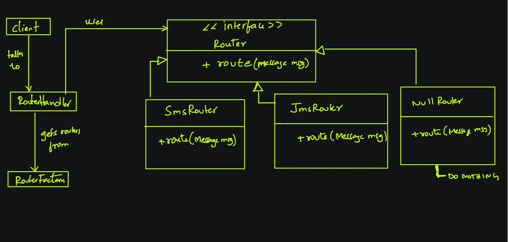

The intent of Null object pattern is to minimize the conditional null checks. Instead, we can identify the null behaviour and encapsulate it in the type expected by the client code. More often than not, such neutral logic would be to simply *DO NOTHING*. This way we can avoid the conditional null checks.

We simply may treat null objects the same way we treat any other instance of a given type that actually contains some more sophisticated business logic. Consequently, the client code stays cleaner.

But just like with any other pattern, you can't just follow this blindly. This pattern can be useful when there is no need for the application to explicitly do anything when it receives a null object. 

But what if our use case is not like that? 

Alternate perspective: 

You must be careful about where & how you use this. In many places, you would instead want your system to throw an exception than keep working with default or null values. An exception is a strong message from system to dev that there is something that we didn't account for and we have to rectify immediately. You would rather want your users to not receive any message than receiving "Hey **NULL**, your shipment of **NULL** is on it's way!".

So tread carefully!!!